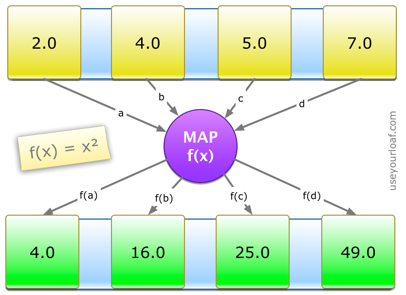
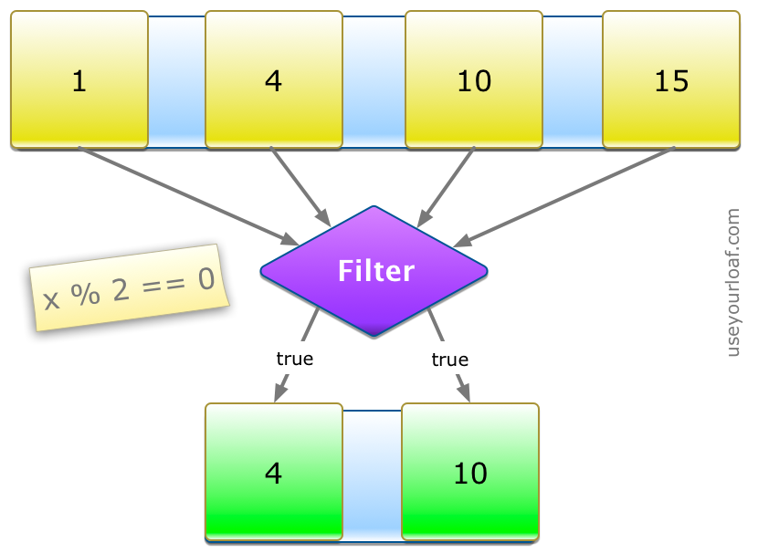
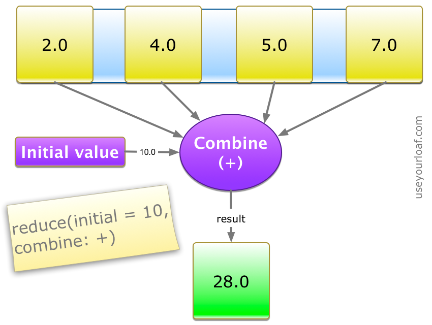

# Week 29

> July 16 to July 22

## Algorithm：

[Leetcode - Medium] 179. Largest Number

```swift
func largestNumber(_ nums: [Int]) -> String {
    guard nums.count > 0 else {
        return ""
    }
    guard nums.filter({$0 > 0}).count > 0 else {
        return "0"
    }
    var strNums = nums.map { value in
        String(value)
    }
    strNums.sort { (str1, str2) -> Bool in
        let combine1 = str1 + str2
        let combine2 = str2 + str1
        return combine1 > combine2
    }
    return strNums.reduce("", +)
}
```

## Review：

[iOS — Identifying Memory Leaks using the Xcode Memory Graph Debugger](https://medium.com/zendesk-engineering/ios-identifying-memory-leaks-using-the-xcode-memory-graph-debugger-e84f097b9d15)

Xcode memory graph debugger可以帮助找到和修复循环引用与内存泄露。当被激活时，会暂停app运行，展现当前堆中的对象，对象的关系，对象间的引用。

## Tip：

Swift Guide to Map Filter Reduce

### Map

Use `map` to loop over a collection and apply the same operation to each element in the collection.


### Filter
Use `filter` to loop over a collection and return an Array containing only those elements that match an include condition.


### Reduce
Use `reduce` to combine all items in a collection to create a single new value.


## Share：

`UITableView style`设置`Plain`与`Grouped`的区别

1. `SectionHeader` 和 `SectionFooter` 在 `Plain` 时是悬停的，在 `Grouped` 不悬停
2. `Grouped` 样式的 `SectionHeader` 是自带间隔的，如果要取消间隔需要在相关代理方法中减去
