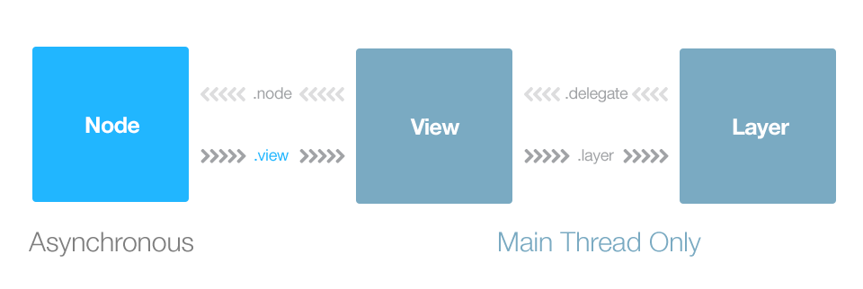

# Week 40

> October 1 to October 7

## Algorithm：
[Leetcode - Hard] 25. Reverse Nodes in k-Group
```swift
func reverseKGroup(_ head: ListNode?, _ k: Int) -> ListNode? {
    if head?.next == nil {
        return head
    }
    let dummy: ListNode? = ListNode(0)
    dummy!.next = head
    var pre = dummy, start = dummy, end = dummy
    while end != nil {
        end = pre
        for _ in 0..<k {
            end = end?.next
            if end == nil {
                return dummy?.next
            }
        }
        for _ in 1..<k {
            start = pre!.next
            pre!.next = start!.next
            start!.next = end!.next
            end!.next = start
        }
        for _ in 0..<k {
            pre = pre!.next
        }
    }
    return dummy!.next
}
```

## Review：
`ASDK` 
- [使用 ASDK 性能调优 - 提升 iOS 界面的渲染性能](https://draveness.me/asdk-rendering)
- [从 Auto Layout 的布局算法谈性能](https://draveness.me/layout-performance)

显示器的刷新频率与 `GPU` 的渲染速度不同，会产生屏幕撕裂。

引入多个缓冲区可以有效地缓解屏幕撕裂，也就是同时使用一个帧缓冲区（`frame buffer`）和多个后备缓冲区（`back buffer`）；在每次显示器请求内容时，都会从帧缓冲区中取出图像然后渲染。

垂直同步（`Vertical synchronization`）的主要作用就是保证只有在帧缓冲区中的图像被渲染之后，后备缓冲区中的内容才可以被拷贝到帧缓冲区中。

根据 `V-Sync` 的原理，优化应用性能、提高 `App` 的 `FPS` 就可以从两个方面来入手，优化 `CPU` 以及 `GPU` 的处理时间。

宽泛的说，大多数的 `CALayer` 的属性都是由 `GPU` 来绘制的，比如图片的圆角、变换、应用纹理；但是过多的几何结构、重绘、离屏绘制（`Offscrren`）以及过大的图片都会导致 GPU 的性能明显降低。

`ASDK` 像是对 `UIKit` 的重新实现，把整个 `UIKit` 以及 `CALayer` 层封装成一个一个 `Node`，将昂贵的渲染、图片解码、布局以及其它 UI 操作移出主线程。

在 `ASDK` 中最基本的单位就是 `ASDisplayNode`，每一个 `node` 都是对 `UIView` 以及 `CALayer` 的抽象。

`ASDisplayNode` 是线程安全的，它可以在后台线程中完成初始化以及配置工作。

AS`DK 将耗时的 `CPU` 操作以及 `GPU` 渲染纹理（`Texture`）的过程全部放入后台进程，使主线程能够快速响应用户操作。

在 `ASDK` 中的渲染围绕 `ASDisplayNode` 进行，其过程总共有四条主线：
1. 初始化 `ASDisplayNode` 对应的 `UIView` 或者 `CALayer`；
2. 在当前视图进入视图层级时执行 `setNeedsDisplay`；
3. `display` 方法执行时，向后台线程派发绘制事务；
4. 注册成为 `RunLoop` 观察者，在每个 `RunLoop` 结束时回调。

如果 `ASDisplayNode` 是 `layerBacked` 的，它不会渲染对应的 `UIView` 以此来提升性能。

在初始化工作完成之后，当 `ASDisplayNode` 第一次被加入到视图的层级时，`-[_ASDisplayView willMoveToWindow:]` 就会被调用。

`_flags` 是 `ASDisplayNodeFlags` 结构体，用于标记当前 `ASDisplayNode` 的一些 `BOOL` 值，比如，异步显示、栅格化子视图等等。

当前结点需要被显示在屏幕上时，如果其内容 `contents` 为空，就会调用 `-[CALayer setNeedsDisplay]` 方法将 `CALayer` 标记为脏的，通知系统需要在下一个绘制循环中重绘视图，在将 `CALayer` 标记为 `dirty` 之后，在绘制循环中就会执行 `-[CALayer display]` 方法，对它要展示的内容进行绘制。

> `ASDK` 中用到了 `CATransaction`

## Tip：
线程休眠：
```objc
sleep(3);

[NSThread sleepForTimeInterval:3];

dispatch_after(dispatch_time(DISPATCH_TIME_NOW, (int64_t)(3 * NSEC_PER_SEC)), dispatch_get_main_queue(), ^{
        
    });
```

`sleep()` 函数阻塞的是当前进程。

## Share：


`TableView` 优化

**预排版**

当获取到 `API JSON` 数据后，把每条 `Cell` 需要的数据都在后台线程计算并封装为一个布局对象 `CellLayout`。`CellLayout` 包含所有文本的 `CoreText` 排版结果、`Cell` 内部每个控件的高度、`Cell` 的整体高度。每个 `CellLayout` 的内存占用并不多，所以当生成后，可以全部缓存到内存，以供稍后使用。这样，`TableView` 在请求各个高度函数时，不会消耗任何多余计算量；当把 `CellLayout` 设置到 `Cell` 内部时，`Cell` 内部也不用再计算布局了。

**预渲染**

对于离屏渲染的圆角在后台线程预先渲染为圆形并单独保存到一个 `ImageCache` 中去。

进一步减少每个 Cell 内图层的数量，用 CALayer 替换掉 UIView

**异步绘制**
当需要显示内容（比如调用了 `[layer setNeedDisplay]`）时，通过 `delegate` 向 `UIView` 请求一个异步绘制的任务。在异步绘制时，`Layer` 会传递一个 `BOOL(^isCancelled)()` 这样的 `block`，绘制代码可以随时调用该 `block` 判断绘制任务是否已经被取消。尽量快速、提前判断当前绘制任务是否已经被取消，防止滑动速度过快时，绘制任务还没有完成就可能已经被取消了。

**卡顿**

用 `CADisplayLink` 来监视 CPU 的卡顿问题。

`KVC` 可以根据给定的一组 `key`，获取到一组 `value`，并且以字典的形式返回。
```objc
- (NSDictionary<NSString *, id> *)dictionaryWithValuesForKeys:(NSArray<NSString *> *)keys;
```
同样，也可以通过 `KVC` 进行批量赋值。
```objc
- (void)setValuesForKeysWithDictionary:(NSDictionary<NSString *, id> *)keyedValues;
```

处理异常可以重写下面两个方法。
```objc
- (nullable id)valueForUndefinedKey:(NSString *)key;
- (void)setValue:(nullable id)value forUndefinedKey:(NSString *)key;
```
