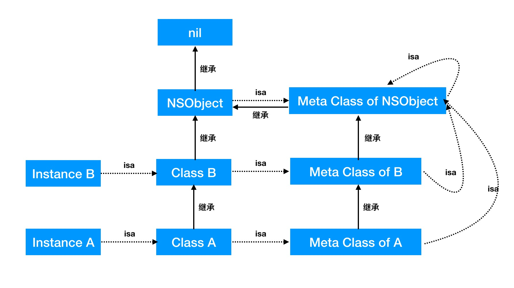

# Week 43

> October 22 to October 28

## Algorithm：
[Leetcode - Medium]

## Review：

## Tip：

对于对象、类、元类之间的关系：
1. 对象是类的一个实例，对象的 `isa` 指向该类
2. 类也是一个对象，类的 `isa` 指向元类
3. 元类也是一个对象，元类的 `isa` 指向根元类
4. 根元类也是一个对象，但是为了形成闭环，故根元类的 `isa` 指向自己
5. 根元类的父类是根类

## Share：

`HTTPS` 过程：

1. 客户端向服务端发送请求，服务端生成非对称的公钥和私钥；
2. 服务端返回数字证书，证书中包含公钥；
3. 客户端验证证书； 
4. 如果证书没问题客户端会生成一个对称加密的随机秘钥，然后用服务器端的公钥对数据进行加密，再发送给服务器端；
5. 服务器端收到以后会用自己的私钥对客户端发来的对称秘钥进行解密；
6. 之后双方就拿着这个对称加密秘钥来进行正常的通信。

