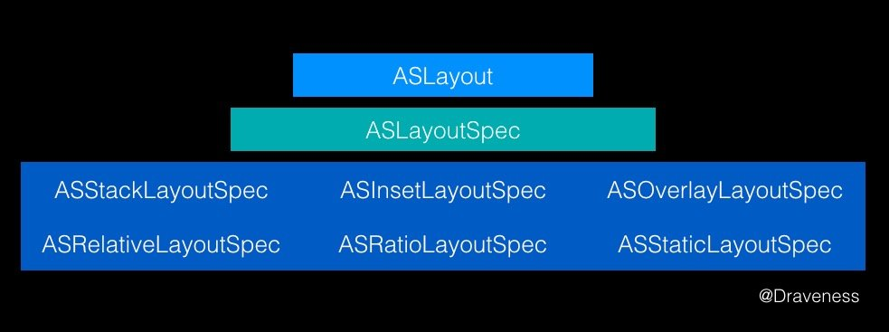

# Week 44

> October 29 to November 4

## Algorithm：


## Review：
`Auto Layout` 的原理就是对线性方程组或者不等式的求解。

`Auto Layout` 不止在复杂 `UI` 界面布局的表现不佳，它还会强制视图在主线程上布局；所以在 `ASDK` 中提供了另一种可以在后台线程中运行的布局引擎，它的结构大致是这样的：

`ASLayoutSpec` 与下面的所有的 `Spec` 类都是继承关系，在视图需要布局时，会调用 `ASLayoutSpec` 或者它的子类的 `- measureWithSizeRange:` 方法返回一个用于布局的对象 `ASLayout`。

使用 `ASDK` 布局时，需要做下面四件事情中的一件：
- 提供 `layoutSpecBlock`
- 覆写 `- layoutSpecThatFits:` 方法，这个方法与 `-[UIView sizeThatFits:]` 相似，区别是计算出的大小会通过缓存来提升性能。文档中推荐在子类中覆写 `- layoutSpecThatFits:` 方法，返回一个用于布局的 `ASLayoutSpec` 对象，然后使用 `ASLayoutSpec` 中的 `- measureWithSizeRange:` 方法对它指定的视图进行布局。
- 覆写 `- calculateSizeThatFits:` 方法，提供了手动布局的方式
- 覆写 `- calculateLayoutThatFits:` 方法，把手动布局和 Spec 布局封装成了一个接口

**总结**
其实 `ASDK` 的布局引擎大部分都是对 `ComponentKit` 的封装，`ASDK` 的布局计算不仅在后台并发线程中进行、而且通过引入 `Flexbox` 提升了布局的性能，但是 `ASDK` 的使用相对比较复杂，如果只想对布局性能进行优化，更推荐单独使用 `ComponentKit` 框架。

## Tip：

开启光栅化
```objc
cell.layer.shouldRasterize = YES;
cell.layer.rasterizationScale = [[UIScreen mainScreen] scale];
```

`CFRunLoopSourceRef` 是事件产生的地方。`Source` 有两个版本：`Source0` 和 `Source1`。
1. `Source0` 只包含了一个回调（函数指针），它并不能主动触发事件。使用时，你需要先调用 `CFRunLoopSourceSignal(source)`，将这个 `Source` 标记为待处理，然后手动调用 `CFRunLoopWakeUp(runloop)` 来唤醒 `RunLoop`，让其处理这个事件。
2. `Source1` 包含了一个 `mach_port` 和一个回调（函数指针），被用于通过内核和其他线程相互发送消息。这种 `Source` 能主动唤醒 `RunLoop` 的线程。
3. 一次 `Loop` 只能执行一个 `Source1` 的回调，但一次 `Loop` 可以执行多个待处理的 `Source0` 的回调。

总的来说，`Source1` 监听端口，当端口有消息到达时，相应的 `Source1` 就会被触发回调；而 `Source0` 并不监听端口，让 `Source0` 执行回调需要手动标记 `Source0` 为待处理状态，还需要呼醒 `Source0` 所在的 `RunLoop`。

## Share：
`CALayer` 与 `UIView` 的区别：
1. 每个 `UIView` 内部都有一个 `CALayer` 在背后提供内容的绘制和显示，并且 `UIView` 的尺寸样式都由内部的 `Layer` 所提供。两者都有树状层级结构，`layer` 内部有 `SubLayers`，`View` 内部有 `SubViews`。但是 `Layer` 比 `View` 多了个 `AnchorPoint`。
2. 在 `View` 显示的时候，`UIView` 做为 `Layer` 的 `CALayerDelegate`，`View` 的显示内容由内部的 `CALayer` 的 `display`。
3. `CALayer` 是默认修改属性支持隐式动画的，在给 `UIView` 的 `Layer` 做动画的时候，`View` 作为 `Layer` 的代理，`Layer` 通过 `actionForLayer:forKey:`向 `View` 请求相应的 `action`(动画行为)。
4. `layer` 内部维护着三分 `layer tree`，分别是 `presentLayer Tree`(动画树)，`modeLayer Tree`(模型树), `Render Tree` (渲染树)，在做 `iOS` 动画的时候，我们修改动画的属性，在动画的其实是 `Layer` 的 `presentLayer` 的属性值，而最终展示在界面上的其实是提供 `View` 的 `modelLayer`。
5. 两者最明显的区别是 `View` 可以接受并处理事件，而 `Layer` 不可以。
