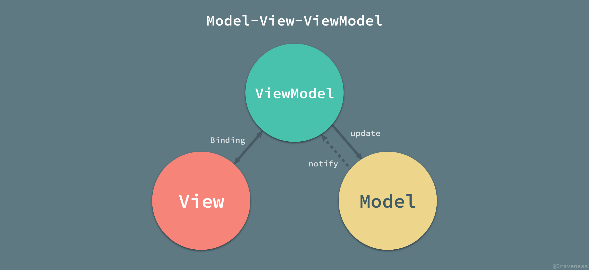

# Week 47

> November 19 to November 25

## Algorithm：
[Leetcode - Medium] 137. Single Number II  
数组中每个数字出现三次，只有一个数字出现一次。时间 `O(n)`，空间 `O(1)`。
```cpp
int singleNumber(vector<int>& nums) {
    int res = 0;
    int one = 1;
    for (int i = 0; i < 64; i++) {
        int temp = 0;
        for (auto num : nums) {
            if (one & num) {
                temp ++;
            }
        }
        if (temp % 3 == 1) {
            res = res | one;
        }
        one = one << 1;
    }
    return res;
}
```

## Review：
### MVC

视图层与控制器层是紧密耦合在一起的，这也是 iOS 项目经常遇到视图控制器非常臃肿的重要原因之一。


控制器负责对模型中的数据进行更新，而视图向模型中请求数据；当有用户的行为触发操作时，会有控制器更新模型，并通知视图进行更新，在这时视图向模型请求新的数据。

### MVP

`MVC` 与 `MVP` 之间的区别其实并不明显，两者之间最大的区别就是 `MVP` 中使用 `Presenter` 对视图和模型进行了解耦，它们彼此都对对方一无所知，沟通都通过 `Presenter` 进行。  
`Presenter` 可以理解为松散的控制器，其中包含了视图的 `UI` 业务逻辑，所有从视图发出的事件，都会通过代理给 `Presenter` 进行处理；同时，`Presenter` 也通过视图暴露的接口与其进行通信。

### MVVM


## Tip：

`[[NSNotificationCenter defaultCenter] postNotification:notify]` 是同步的。
如果是在异步线程发送通知，那么接收通知也是在该线程。

```
- (void)asynNotify {
    dispatch_async(dispatch_get_global_queue(DISPATCH_QUEUE_PRIORITY_DEFAULT, 0), ^{
        NSLog(@"post: %@", [NSThread currentThread]);
        NSNotification *notify = [NSNotification notificationWithName:@"ASYN" object:nil];
        [[NSNotificationCenter defaultCenter] postNotification:notify];
        NSLog(@"end");
    });
}
// -----------------
- (void)addNotify {
    [[NSNotificationCenter defaultCenter] addObserver:self selector:@selector(notifyMain) name:@"ASYN" object:nil];
}
- (void)notifyMain {
    NSLog(@"recive: %@", [NSThread currentThread]);
}
```
输出为：
```
post: <NSThread: 0x10281a040>{number = 2, name = (null)}
recive: <NSThread: 0x10281a040>{number = 2, name = (null)}
end
```

## Share：

`- (Class)class` 方法的实现：
```
- (Class)class {
    return object_getClass(self);
}
```

在 `KVO` 生成的子类中 `class` 方法被重写，返回的是父类来欺骗用户：
```
- (Class)class {
    return class_getSuperclass(object_getClass(self));
}
```