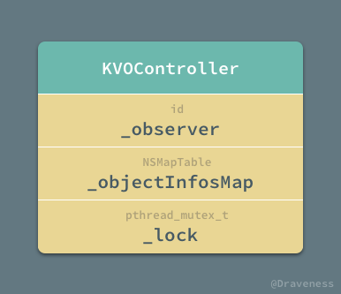
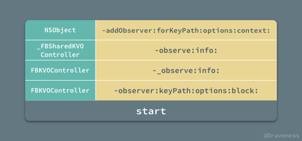
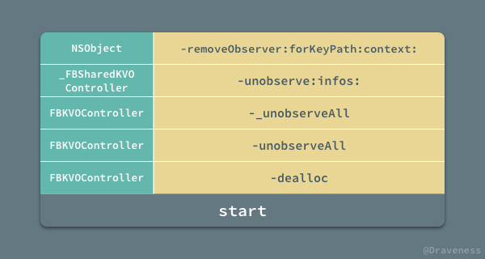

# Week 48

> November 26 to December 2

## Algorithm：
问题：实现两个操作，add：添加一个整数；median：返回所有整数的中位数：
方法一：双向链表加一个指针指向中位数，此时 add 操作时间复杂度 O(n)，median 操作时间复杂度 O(1)；
方法二：使用数组基于快排的查找返回中位数，此时 add 操作时间复杂度 O(1)，median 操作时间复杂度 O(n)（比快排要快一些）；
方法三：基于二叉树，每个结点记录左子树和右子树的个数，此时 add 操作时间复杂度 O(logn)，median 操作时间复杂度 O(logn)）；

## Review：
[如何优雅地使用 KVO](https://draveness.me/kvocontroller)

`KVOController` 用到的数据结构是 `NSMapTable`。  


`KVOController` 和 `KVOControllerNonRetaining` 的区别就体现在生成的 `NSMapTable` 实例时传入的是 `NSPointerFunctionsStrongMemory` 还是 `NSPointerFunctionsWeakMemory` 选项。

```objc
- (instancetype)initWithObserver:(nullable id)observer retainObserved:(BOOL)retainObserved
{
  self = [super init];
  if (nil != self) {
    _observer = observer;
    // retainObserved 区分 KVOController 和 KVOControllerNonRetaining
    NSPointerFunctionsOptions keyOptions = retainObserved ? 
        NSPointerFunctionsStrongMemory|NSPointerFunctionsObjectPointerPersonality : 
        NSPointerFunctionsWeakMemory|NSPointerFunctionsObjectPointerPersonality;
    _objectInfosMap = [[NSMapTable alloc] initWithKeyOptions:keyOptions 
                        valueOptions:NSPointerFunctionsStrongMemory|NSPointerFunctionsObjectPersonality 
                        capacity:0];
    pthread_mutex_init(&_lock, NULL);
  }
  return self;
}
```
### observe 调用过程  


在 `-observeValueForKeyPath:ofObject:change:context:` 回调方法中，`_FBKVOSharedController` 会根据 `KVO` 的信息 `_KVOInfo` 选择不同的方式分发事件。
```objc
- (void)observeValueForKeyPath:(nullable NSString *)keyPath
                      ofObject:(nullable id)object
                        change:(nullable NSDictionary<NSKeyValueChangeKey, id> *)change
                       context:(nullable void *)context
{
  NSAssert(context, @"missing context keyPath:%@ object:%@ change:%@", keyPath, object, change);

  _FBKVOInfo *info;

  {
    pthread_mutex_lock(&_mutex);
    info = [_infos member:(__bridge id)context];
    pthread_mutex_unlock(&_mutex);
  }

  if (nil != info) {

    FBKVOController *controller = info->_controller;
    if (nil != controller) {

      id observer = controller.observer;
      if (nil != observer) {

        if (info->_block) {
          NSDictionary<NSKeyValueChangeKey, id> *changeWithKeyPath = change;
          if (keyPath) {
            NSMutableDictionary<NSString *, id> *mChange = [NSMutableDictionary dictionaryWithObject:keyPath forKey:FBKVONotificationKeyPathKey];
            [mChange addEntriesFromDictionary:change];
            changeWithKeyPath = [mChange copy];
          }
          info->_block(observer, object, changeWithKeyPath);
        } else if (info->_action) {
          [observer performSelector:info->_action withObject:change withObject:object];
        } else {
          [observer observeValueForKeyPath:keyPath ofObject:object change:change context:info->_context];
        }
      }
    }
  }
}
```

### removeObserver


不需要手动去处理 `KVO` 观察者的移除，因为所有的 `KVO` 事件都由私有的 `_KVOSharedController` 来处理

## Tip：
### 指定任意圆角：
```objc
UIBezierPath *maskPath = [UIBezierPath bezierPathWithRoundedRect:view.bounds 
    byRoundingCorners:UIRectCornerBottomLeft | UIRectCornerBottomRight 
    cornerRadii:CGSizeMake(10,10)];
CAShapeLayer *maskLayer = [[CAShapeLayer alloc] init];
maskLayer.frame = view.bounds;
maskLayer.path = maskPath.CGPath;
view.layer.mask = maskLayer;
```
### 手动 KVO
```objc
+ (BOOL)automaticallyNotifiesObserversForKey:(NSString *)key;
```

### objectForKey 和 valueForKey
```
- (ObjectType)objectForKey:(KeyType)aKey;
- (id)valueForKey:(NSString *)key;
```

```
NSDictionary *dic = @{@1: @"123", @"1": @456};
NSLog(@"%@", [dic objectForKey:@1]);
NSLog(@"%@", [dic valueForKey:@"1"]);
```

### HTTP 消息结构
`Request` 消息分为3部分，第一部分叫 `Request line`, 第二部分叫 `Request header`, 第三部分是 `Request body`。  
`header` 和 `body` 之间有个空行。

### GET POST 不同
- `GET` 参数通过 `URL` 传递，`POST` 放在 `Request body` 中，`URL` 参数有长度限制
- `GET` 产生一个 `TCP` 数据包；`POST` 产生两个 `TCP` 数据包。
- 对于 `GET`，浏览器会把 `header` 和 `data` 一并发送，服务器响应 `200`；对于 `POST`，先发送 `header`，服务器响应 `100 continue`，再发送 `data`，服务器响应 `200`。

### `imageNamed` 与 `imageWithContentsOfFile`
- 用 `imageNamed` 的方式加载时，系统会把图像 `Cache` 到内存。
- `imageWithContentsOfFile` 方法只是简单的加载图片，并不会将图片缓存起来

## Share：

- 浅复制(`shallow copy`)：在浅复制操作时，对于被复制对象的每一层都是指针复制。
- 深复制(`one-level-deep copy`)：在深复制操作时，对于被复制对象，至少有一层是深复制。
- 完全复制(`real-deep copy`)：在完全复制操作时，对于被复制对象的每一层都是对象复制。

### 非容器 不可变  
- NSString copy 浅拷贝  
- NSString mutablecopy 深拷贝  
```objc
NSString *str = [NSString stringWithFormat:@"durian"];
NSLog(@"%p %p %p", str, [str copy], [str mutableCopy]);
// 0xe43887a850caccb7 0xe43887a850caccb7 0x600003cae5b0
```

### 非容器 可变  
- NSMutableString copy 深拷贝  
- NSMutableString mutablecopy 深拷贝  
```objc
NSMutableString *mutable_str = [NSMutableString stringWithFormat:@"durian"];
NSLog(@"%p %p %p", mutable_str, [mutable_str copy], [mutable_str mutableCopy]);
// 0x600003caa0d0 0xe43887a850caccb7 0x600003caa1c0
```

### 容器 不可变  
- NSArray copy 浅拷贝  
- NSArray mutablecopy 深拷贝  
```objc
NSArray *arr = [NSArray arrayWithObject:@"durian"];
NSLog(@"%p %p %p", arr, [arr copy], [arr mutableCopy]);
// 0x6000030e0210 0x6000030e0210 0x600003cbd1a0
```

### 容器 可变  
- NSMutableArray copy 深拷贝  
- NSMutableArray mutablecopy 深拷贝  
```objc
NSMutableArray *mutable_arr = [NSMutableArray arrayWithObject:@"durian"];
NSLog(@"%p %p %p", mutable_arr, [mutable_arr copy], [mutable_arr mutableCopy]);
// 0x600003cb53e0 0x6000030f82b0 0x600003cb6520
```

### 单层深复制 (one-level-deep copy)  
- initWithArray:copyitem
```objc
NSMutableArray *arr_mutablecopy = [arr mutableCopy];
NSLog(@"%p %p", [arr firstObject], [arr_mutablecopy firstObject]);
// 0x108f1f060 0x108f1f060
NSMutableArray *arr_completecopy = [[NSMutableArray alloc] initWithArray:arr copyItems:YES];
NSLog(@"%p %p", [arr firstObject], [arr_completecopy firstObject]);
// 0x108f1f060 0x108f1f060
```

### 完全复制(real-deep copy)

- unarchiveObjectWithData:
```objc
NSArray *trueDeepCopyArray = [NSKeyedUnarchiver unarchiveObjectWithData:[NSKeyedArchiver archivedDataWithRootObject:arr]];
NSLog(@"%p %p", [arr firstObject], [trueDeepCopyArray firstObject]);
// 0x108076060 0xb7ffcb047f285c8c
```