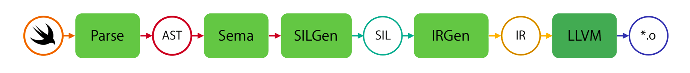

# Week 05

> January 28 to February 3

## Algorithm：

## Review：
[SwiftSyntax](https://swift.gg/2019/01/25/nshipster-swiftsyntax/)
`SwiftSyntax` 是一个可以分析、生成以及转换 `Swift` 源代码的 `Swift` 库，是为了给结构化编辑（`structured editing`）提供安全、正确且直观的工具。  
`Swift` 编译器的架构

使用命令行
```bash
$ xcrun swiftc -frontend -emit-syntax ./One.swift
```
运行的结果为一串 `JSON` 格式的 `AST`。
> AST: Abstract syntax tree  
> SIL: Swift Intermediate Language  
> IR: Intermediate representation

## Tip：
### defer
`defer` 关键字只在表达式离开作用域时运行，通过一个 `block` 使得这种方法安全且简洁。  
比如：
```swift
func currentHostName() -> String {
    let capacity = Int(NI_MAXHOST)
    let buffer = UnsafeMutablePointer<Int8>.allocate(capacity: capacity)

    guard gethostname(buffer, capacity) == 0 else {
        buffer.deallocate()
        return "localhost"
    }

    let hostname = String(cString: buffer)
    buffer.deallocate()

    return hostname
}
```
`buffer` 每次都需要 `deallocate`，这样代码不简洁
```swift
func currentHostName() -> String {
    let capacity = Int(NI_MAXHOST)
    let buffer = UnsafeMutablePointer<Int8>.allocate(capacity: capacity)
    defer { buffer.deallocate() }

    guard gethostname(buffer, capacity) == 0 else {
        return "localhost"
    }

    return String(cString: buffer)
}
```
使用 `defer` 可以保证 `return` 时 `buffer` 会被 `deallocate`  
`defer` 常用在一些需要成对出现的 `API` 中，比如 `allocate(capacity:) / deallocate()`， `wait() / signal()`， 或者 `open() / close()`。

## Share：
### Git Rename
1. Rename your local branch.
- If you are on the branch you want to rename:
    ```
    git branch -m new-name
    ```
- If you are on a different branch:

    ```
    git branch -m old-name new-name
    ```
2. Delete the old-name remote branch and push the new-name local branch.
    ```
    git push origin :old-name new-name
    ```
3. Reset the upstream branch for the new-name local branch.
- Switch to the branch and then:
    ```
    git push origin -u new-name
    ```