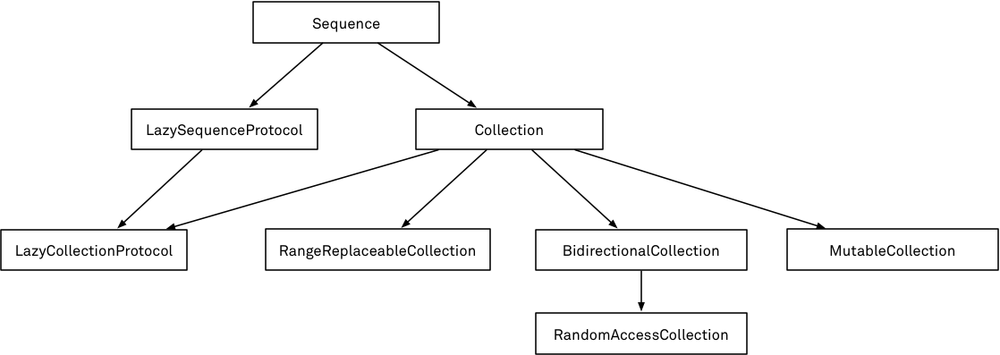

# Week 15

> April 8 to April 14

## Algorithm：

## Review：
### Collection Protocols


## Tip：
### 前缀和后缀运算符重载
要实现前缀或者后缀运算符，需要在声明运算符函数的时候在 `func` 关键字之前指定 `prefix` 或者 `postfix` 修饰符：
```swift
extension Vector2D {
    static prefix func - (vector: Vector2D) -> Vector2D {
        return Vector2D(x: -vector.x, y: -vector.y)
    }
}
```

### 复合赋值运算符重载
复合赋值运算符将赋值运算符`（=）`与其它运算符进行结合。在实现的时候，需要把运算符的左参数设置成 `inout` 类型，因为这个参数的值会在运算符函数内直接被修改。
```swift
extension Vector2D {
    static func += (left: inout Vector2D, right: Vector2D) {
        left = left + right
    }
}
```

### 等价运算符重载
为了使用等价运算符对自定义的类型进行判等运算，需要为“相等”运算符提供自定义实现，实现的方法与其它中缀运算符一样, 并且增加对标准库 `Equatable` 协议的遵循：
```swift
extension Vector2D: Equatable {
    static func == (left: Vector2D, right: Vector2D) -> Bool {
        return (left.x == right.x) && (left.y == right.y)
    }
}
```

`Swift` 为以下数种自定义类型提供等价运算符的默认实现：
- 只拥有存储属性，并且它们全都遵循 `Equatable` 协议的结构体
- 只拥有关联类型，并且它们全都遵循 `Equatable` 协议的枚举
- 没有关联类型的枚举
在类型原始的声明中声明遵循 `Equatable` 来接收这些默认实现。

`Vector3D` 获得了默认的等价运算符实现。
```swift
struct Vector3D: Equatable {
    var x = 0.0, y = 0.0, z = 0.0
}
```
### 自定义运算符
新的运算符要使用 `operator` 关键字在全局作用域内进行定义，同时还要指定 `prefix`、`infix` 或者 `postfix` 修饰符
```swift
prefix operator +++
extension Vector2D {
    static prefix func +++ (vector: inout Vector2D) -> Vector2D {
        vector += vector
        return vector
    }
}
```
### 优先级
当定义前缀与后缀运算符的时候，我们并没有指定优先级。然而，如果对同一个值同时使用前缀与后缀运算符，则后缀运算符会先参与运算。

## Share