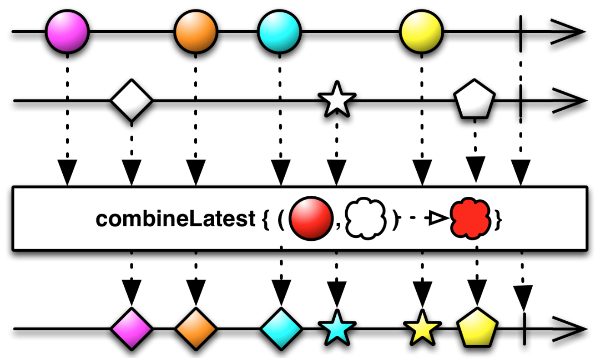
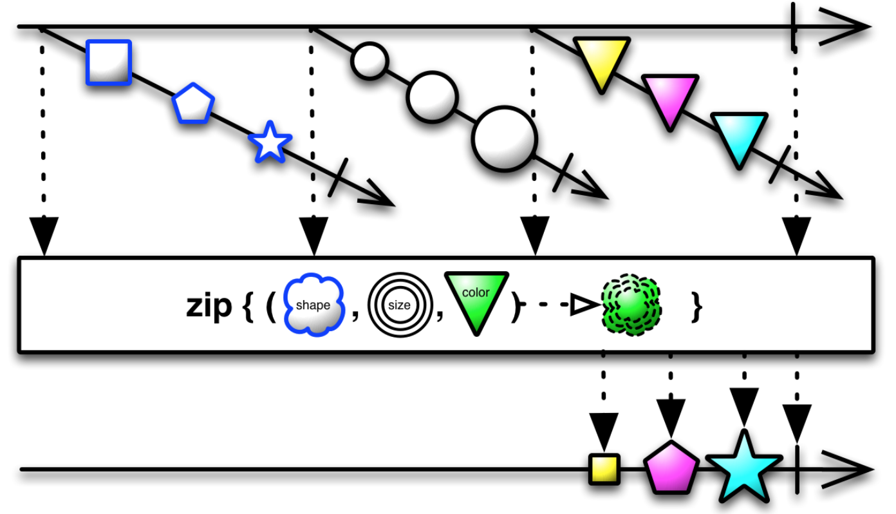
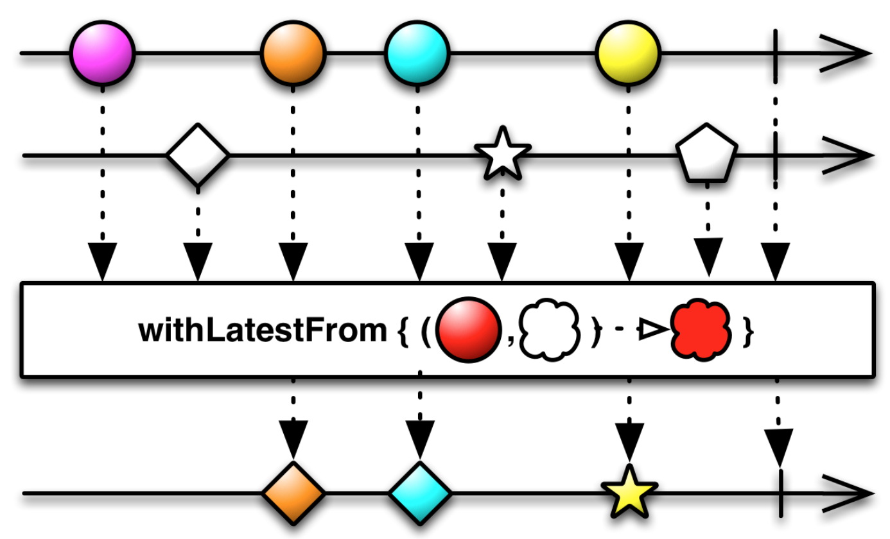

# Week 29

> Jul 15 to Jul 21

## Algorithm：

## Review：

## Tip：

## Share:
### [RxSwift Combining Operators: combineLatest, zip and withLatestFrom](https://medium.com/swift-india/rxswift-combining-operators-combinelatest-zip-and-withlatestfrom-521d2eca5460)

- combineLatest:
`combineLatest` is an operator which you want to use when value depends on the mix of some others Observables.

- zip:
`zip` operator combine the emissions of multiple Observables together via a specified closure and emit single items for each combination based on the results of this closure.

- withLatestFrom:
This operator merges two observable sequences into one observable sequence by combining each element from self with the latest item from the second source.

