# 定义
> An affine transformation matrix for use in drawing 2D graphics.

```swift
/* Return the transform [ a b c d tx ty ]. */
    
/* Return a transform which translates by `(tx, ty)':
        t' = [ 1 0 0 1 tx ty ] */
public /*not inherited*/ init(translationX tx: CGFloat, y ty: CGFloat)


/* Return a transform which scales by `(sx, sy)':
        t' = [ sx 0 0 sy 0 0 ] */
public /*not inherited*/ init(scaleX sx: CGFloat, y sy: CGFloat)


/* Return a transform which rotates by `angle' radians:
        t' = [ cos(angle) sin(angle) -sin(angle) cos(angle) 0 0 ] */
public /*not inherited*/ init(rotationAngle angle: CGFloat)
```

## Affine
> In geometry, an affine transformation, affine map or an affinity is a function between affine spaces which `preserves points, straight lines and planes`. Also, sets of parallel lines remain parallel after an affine transformation. An affine transformation does not necessarily preserve angles between lines or distances between points, though it does preserve ratios of distances between points lying on a straight line.

简单来说，一个图形经过一次仿射变换后，图形中平行的两条线在变换之后任然保持平行。

- Affine vs Projective  
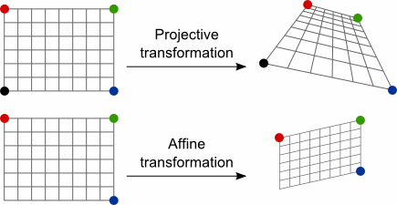

- Fractal，分形  
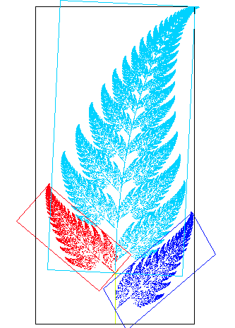

- Transformation Types  
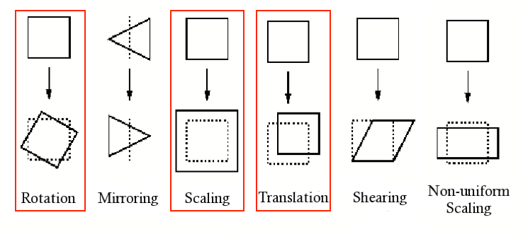

## Transformation Matrix
`CGAffineTransform` 提供了一个变换矩阵。  

  

在 `CGAffineTransform` 中，`affine transform` 公式为：

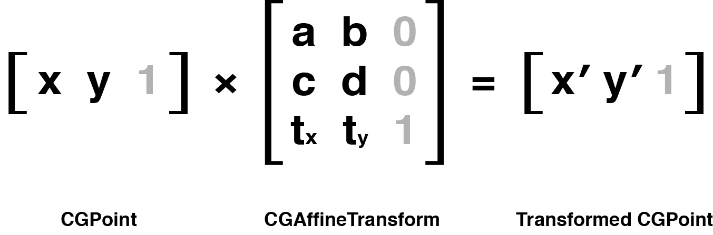  

图中显示的灰色元素，为了能让矩阵做乘法，左边矩阵的列数一定要和右边矩阵的行数个数相同，所以要给矩阵填充一些标志值，使得既可以让矩阵做乘法，又不改变运算结果，并且没必要存储这些添加的值，因为它们的值不会发生变化，但是要用来做运算。

# Calculate
矩阵计算

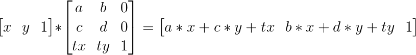

所以 `(x', y')` 实际上是：

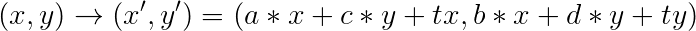

即

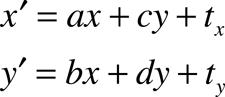

## Translate
```swift
/* Return a transform which translates by `(tx, ty)':
        t' = [ 1 0 0 1 tx ty ] */
public /*not inherited*/ init(translationX tx: CGFloat, y ty: CGFloat)
```
比如，`(x, y) -> (x + 100, y)`

矩阵计算：  

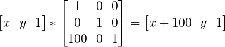

变换矩阵为：  

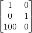

所以：

`t' = [ 1 0, 0 1, tx ty ]`

## Scale
```swift
/* Return a transform which scales by `(sx, sy)':
        t' = [ sx 0 0 sy 0 0 ] */
public /*not inherited*/ init(scaleX sx: CGFloat, y sy: CGFloat)
```
比如，`(x, y) -> (2x, 2y)`

矩阵计算：

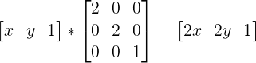

变换矩阵为：  

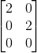

所以：

`t' = [ 2 0, 0 2, 0 0 ]`

## Rotate
```swift
/* Return a transform which rotates by `angle' radians:
        t' = [ cos(angle) sin(angle) -sin(angle) cos(angle) 0 0 ] */
public /*not inherited*/ init(rotationAngle angle: CGFloat)
```

比如，`(x, y)`旋转角度 `a`

矩阵计算：

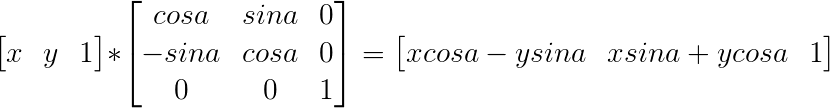

变换矩阵为：  

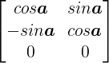

所以：

`t' = [ cosa sina, -sina cosa, 0 0 ]`

### 二维向量旋转公式
- 逆时针  
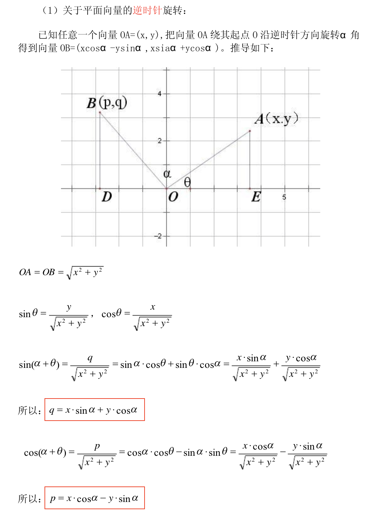

- 变换矩阵为：  

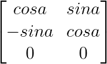

- 顺时针  
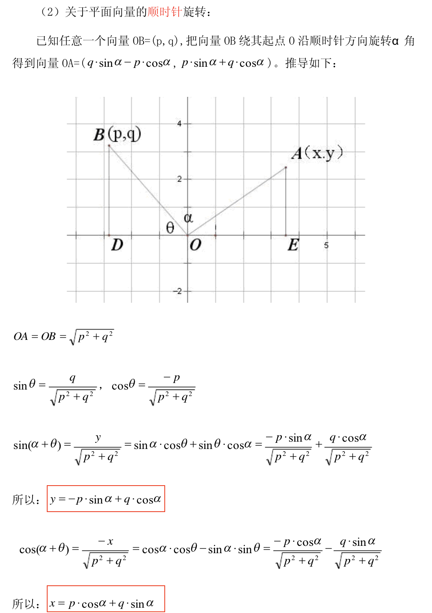

- 变换矩阵为：  

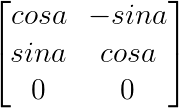

- 结论  
`CGAffineTransform` 为 **逆时针** 变换。但是因为 `iOS` 的坐标系其实是 `Mac OS` 坐标系沿 `x` 轴的镜像，所以在 `iOS` 中 `Rotate` 表现为 **顺时针** 变换。

> Tip:  
> 此处的变换不代表动画。

# Code
## Identify Matrix
当操纵一个变换的时候，初始生成一个什么都不做的变换很重要，也就是创建一个` CGAffineTransform` 类型的空值，矩阵论中称作单位矩阵，`Core Graphics` 同样也提供了一个方便的常量：
```swift
static var identity: CGAffineTransform { get }
```

## Cocat
合并两个 `transform`，如果需要混合两个已经存在的变换矩阵，就可以使用如下方法：
```swift
/* Concatenate `t2' to `t1' and return the result:
         t' = t1 * t2 */
public func concatenating(_ t2: CGAffineTransform) -> CGAffineTransform
```

## Example 1


```swift
// 90 degress
let transform = CGAffineTransform(rotationAngle: .pi / 2.0)
// -90 degress
let transform = CGAffineTransform(rotationAngle: .pi / -2.0)
// 270 degress
let transform = CGAffineTransform(rotationAngle: .pi / 2.0 * 3.0)
```

思考，以上代码如何旋转？顺时针？逆时针？

## Example 2
```swift
var transform: CGAffineTransform = CGAffineTransform()
//scale by 50%
transform = transform.scaledBy(x: 0.5, y: 0.5)
//rotate by 45 degrees
transform = transform.rotated(by: .pi / 4.0)
//translate by 200 points
transform = transform.translatedBy(x: 300, y: 0)
```
如果一个 `view` 添加如上 `transform`，`view` 最终什么样？